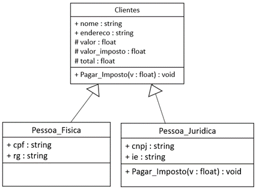

Para realizar essa atividade você primeiramente deverá analisar e compreender a Situação Problema, bem como interpretar o diagrama de classes a seguir, na qual poderá verificar os atributos e métodos das classes.

Após essa análise você irá desenvolver o sistema de controle de clientes, em que será importante aplicar os seguintes elementos da linguagem C#:
Entrada e saída de dados;
Declaração de variáveis.
Operadores aritméticos;
Estruturas condicionais e de repetição se necessário;
Operadores relacionais e lógicos.
Também irá aplicar conceitos de Programação Orientada a Objetos – POO:
Abstração;
Classes, propriedades e métodos;
Herança;
Polimorfismo;
Encapsulamento.
Além de codificar, depurar, executar e testar o sistema como um todo.